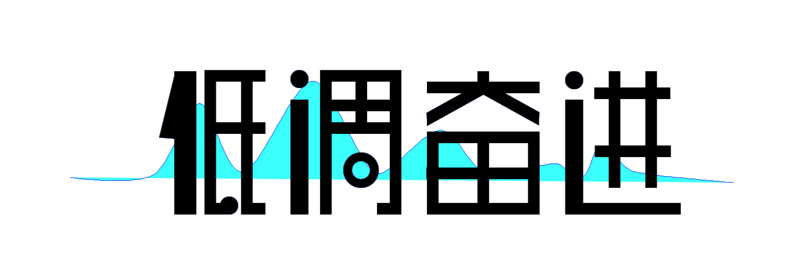

.. yqlibook documentation master file, created by
   sphinx-quickstart on Thu Dec 29 15:16:23 2022.
   You can adapt this file completely to your liking, but it should at least
   contain the root `toctree` directive.

机器学习与AIGC
====================================

.. toctree::
   :maxdepth: 3
   :caption: 深度学习

    深度学习 <content/deep_learning/index>

.. toctree::
   :maxdepth: 3
   :caption: 语音

    语音 <content/speech/index>

.. toctree::
   :maxdepth: 3
   :caption: 文本

    文本 <content/text/index>

.. toctree::
   :maxdepth: 3
   :caption: 视觉

    视觉 <content/cv/index>

.. toctree::
   :maxdepth: 3
   :caption: 多模态

    多模态 <content/multimodal/index>

    欢迎关注公众号:低调奋进 
    `个人技术网站 <http://yqli.tech/>`_ \
    邮箱：yongqiangli@alumni.hust.edu.cn 1377830123@qq.com \

